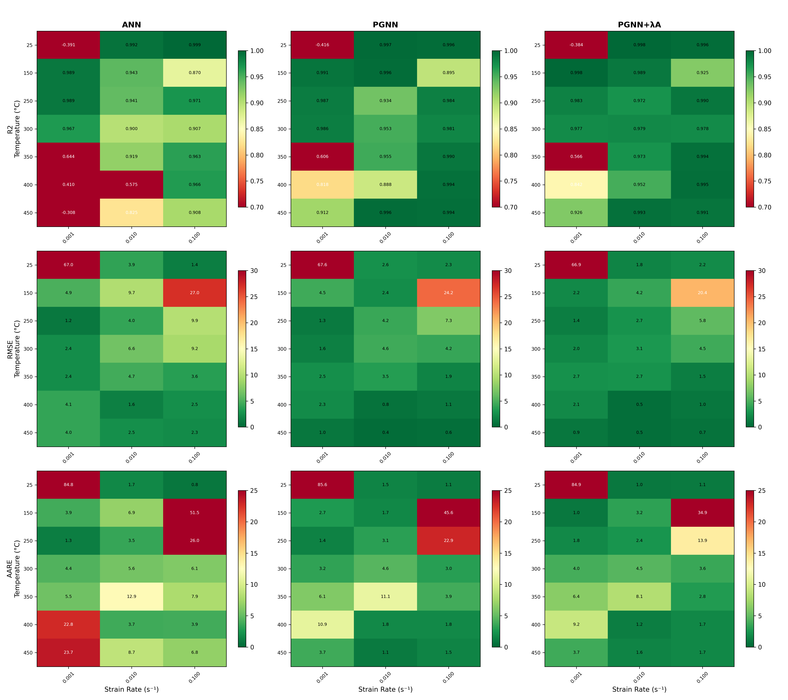
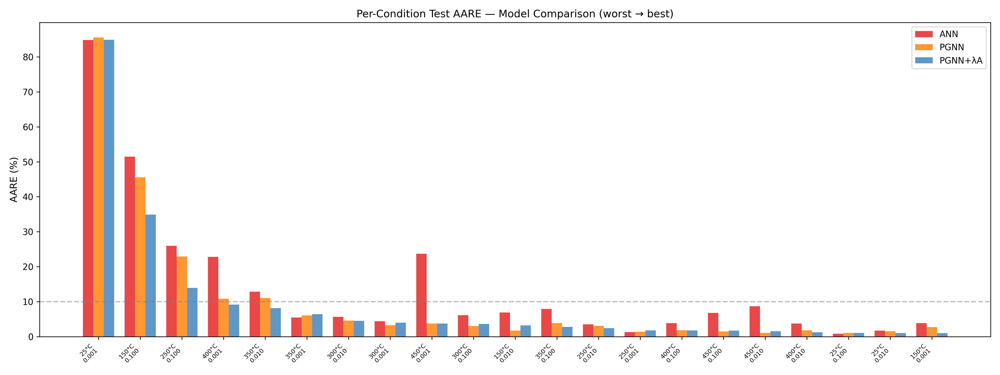
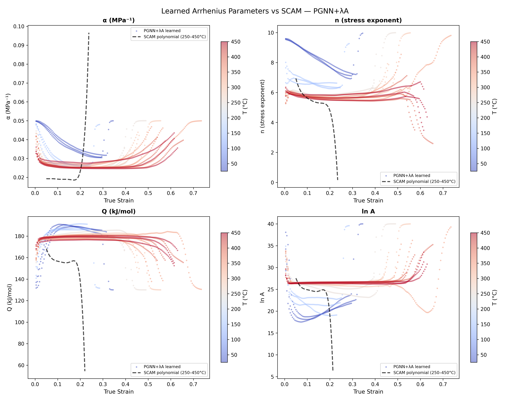
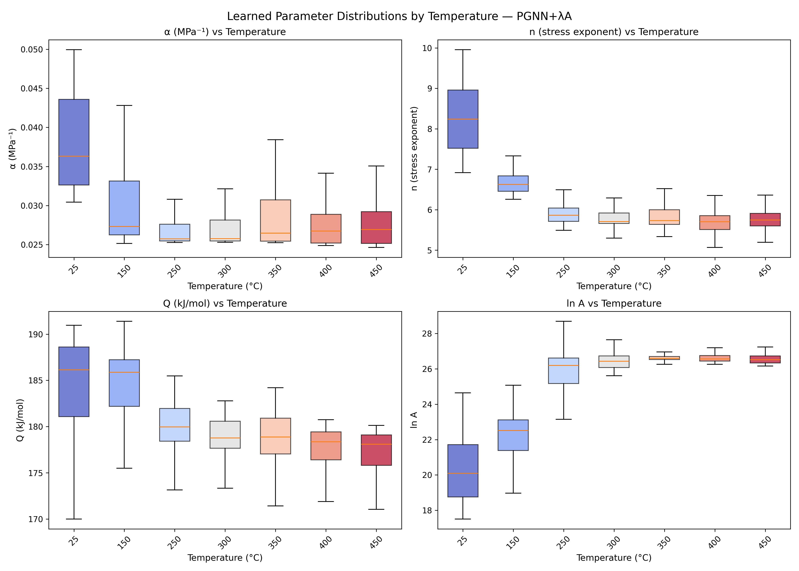
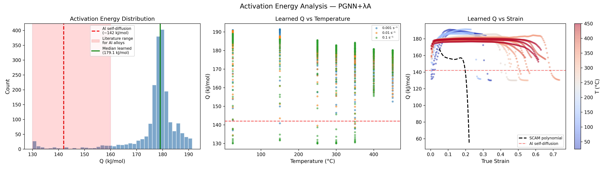
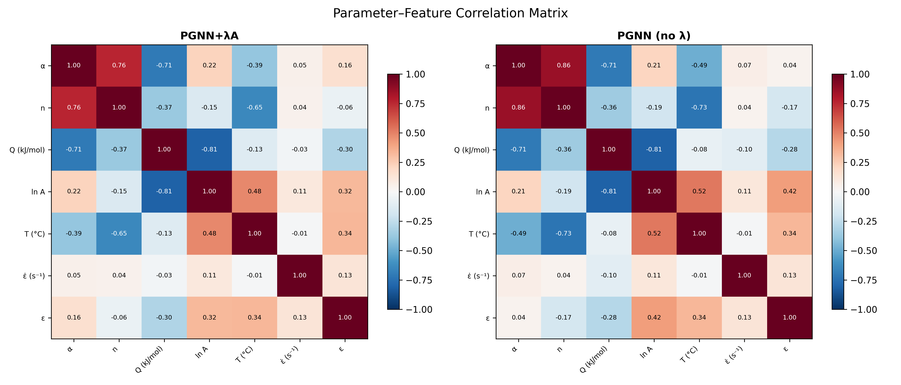

# Results & Analysis

## Material & Dataset

- **Alloy:** Al 6011-O aluminum
- **Test conditions:** 7 temperatures (RT–450°C) × 3 strain rates (0.001–0.1 s⁻¹) = 21 conditions
- **Data points:** 1,982 (downsampled from raw tensile tests at Δε = 0.005)
- **Split:** 70% train / 15% validation / 15% test, stratified by condition

## Models Compared

| Model | Description |
|-------|------------|
| SCAM | Traditional Strain-Compensated Arrhenius Model — 6th-order polynomial regression for each parameter at each strain level |
| ANN | Black-box neural network [3→128→128→64→1] — predicts stress directly, no physics embedded |
| PGNN | Physics-guided neural network — learns Arrhenius parameters (α, n, Q, lnA) through sigmoid-bounded heads, data loss only |
| PGNN+λA | PGNN with additional physics-regularization loss using warmup + grid-search λ balancing (best model) |

We also tested two other λ-balancing strategies (adaptive ratio and gradient-norm), but neither improved over the base PGNN, so we focus on λA.

## Overall Performance

### Training Set

| Model | R² | RMSE (MPa) | AARE (%) |
|-------|-----|-----------|----------|
| SCAM | -4.68 | 72.41 | 60.64 |
| ANN | 0.981 | 8.01 | 9.80 |
| PGNN | 0.992 | 5.00 | 4.53 |
| **PGNN+λA** | **0.994** | **4.37** | **3.85** |

### Validation Set

| Model | R² | RMSE (MPa) | AARE (%) |
|-------|-----|-----------|----------|
| SCAM | -3.00 | 60.41 | 55.47 |
| ANN | 0.954 | 12.37 | 9.70 |
| PGNN | 0.959 | 11.70 | 5.34 |
| **PGNN+λA** | **0.960** | **11.52** | **4.72** |

### Test Set

| Model | R² | RMSE (MPa) | AARE (%) |
|-------|-----|-----------|----------|
| SCAM | -4.19 | 69.00 | 53.99 |
| ANN | 0.939 | 13.64 | 12.24 |
| PGNN | 0.944 | 13.06 | 8.28 |
| **PGNN+λA** | **0.947** | **12.64** | **7.33** |

### Thermally Activated Range (250–450°C) — Fair Comparison with SCAM

Since SCAM was fit on the 250–450°C range only (excluding RT and 150°C due to DSA anomaly), a fair comparison uses the same 15 conditions:

| Model | Avg AARE (%) |
|-------|-------------|
| SCAM | 54.04 |
| ANN | 9.51 |
| PGNN | 5.33 |
| **PGNN+λA** | **4.44** |

Even on SCAM's "home turf," the physics-guided models dramatically outperform it. The PGNN+λA achieves 4.44% AARE — a 12× improvement over SCAM.

**Key observations:**

SCAM fails catastrophically (negative R²) because polynomial regression cannot capture the complex, non-linear parameter evolution across all strain levels simultaneously. The PGNN architecture handles all conditions through a single model. Among ML models, PGNN+λA achieves the best generalization — the gap between train and test AARE (3.85% → 7.33%) is smaller than ANN's gap (9.80% → 12.24%), suggesting the physics constraint acts as effective regularization.

## Per-Condition Analysis

Per-condition metrics (R², RMSE, AARE for every temperature × strain rate combination) are available in [`Futher_analysis_results/per_condition_metrics.csv`](Futher_analysis_results/per_condition_metrics.csv).

### Heatmap — Per-Condition Performance

The heatmap shows R², RMSE, and AARE for each of the 21 conditions across ANN, PGNN, and PGNN+λA. PGNN+λA is most consistent across conditions, with fewer "hot spots" of high error.

### Bar Chart — Worst-to-Best Conditions

Conditions ranked by AARE from worst to best. The hardest conditions for all models tend to be the room temperature and 150°C cases (DSA anomaly region), but PGNN+λA handles them notably better than the pure ANN.

## Physical Insight Analysis

The core contribution of this work: the PGNN learns physically meaningful parameters without being explicitly taught their values. We can extract and analyze these learned parameters to verify they match known materials science.

### Learned Parameters vs SCAM Polynomials

The four Arrhenius parameters (α, n, Q, lnA) learned by the PGNN are compared against the SCAM polynomial fits. The PGNN discovers similar trends but with more flexibility — it is not constrained to follow a 6th-order polynomial, allowing it to capture non-smooth transitions.

### Parameter Evolution with Temperature

Box-plots of each parameter grouped by temperature reveal physically consistent trends:

- **Stress exponent n** decreases with increasing temperature — consistent with a transition from dislocation glide to dislocation climb as the dominant deformation mechanism
- **Activation energy Q** remains relatively stable around 179 kJ/mol, within the expected range for Al 6xxx alloys (130–180 kJ/mol in literature)
- **α** stays within the typical range for aluminum alloys (0.01–0.03 MPa⁻¹)

### Activation Energy Analysis

The learned activation energy Q ≈ 179 kJ/mol is consistent with thermally activated dislocation motion in Al 6xxx alloys. The Q distribution is tight, indicating the model has confidently converged on a physically meaningful value rather than scattering across the allowed range.

### Parameter Correlation Matrix

A strong anti-correlation between Q and lnA (r = −0.81) emerges naturally — this is the well-known **compensation effect** in hot deformation, where higher activation energy is offset by a higher frequency factor. The model discovers this relationship without any explicit constraint, validating that the architecture is learning real physics.

## Uncertainty Quantification

Using MC Dropout (100 forward passes with dropout enabled at inference), the best model achieves:

- **PICP** (Prediction Interval Coverage Probability): 93.4% — close to the 95% target, meaning the model's confidence intervals capture most true values
- **MPIW** (Mean Prediction Interval Width): 12.13 MPa — reasonably tight intervals

## Summary

The PGNN+λA model achieves three goals simultaneously:

1. **Accuracy** — R² = 0.947, AARE = 7.33% on the test set, outperforming both traditional SCAM and black-box ANN
2. **Interpretability** — learned parameters match known physical properties of Al 6xxx alloys (Q ≈ 179 kJ/mol, n ≈ 5.5–8, compensation effect)
3. **Generalization** — physics constraints reduce overfitting, with smaller train-test performance gaps than the unconstrained ANN

The key methodological contribution is that the network discovers known physics without supervision, validating that the architecture is genuinely learning material behavior rather than just fitting curves.
